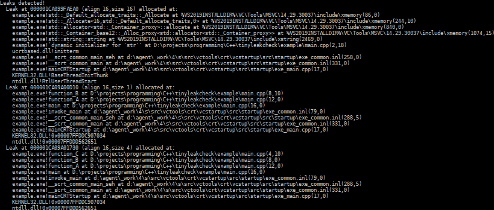

# TinyLeakCheck

TinyLeakCheck is a tiny, standalone, thread-safe memory tracer and leak checker.

For example, the following code (a simplified version of [a bundled example](examples/leaks.cpp)):
```cpp
#include <tinyleakcheck/tinyleakcheck.hpp>

std::string str; //Static leak

static void function_C() { new int; } //Leak 4
static void function_B()
{
	function_C();
	new char; //Leak 1
}
static void function_A() { function_B(); }

int main( int, char*[] )
{
	TinyLeakCheck::prevent_linker_elison();
	function_A();
	return 0;
}
```
Produces the following output (output may not exactly match due to minor code changes and your environment):




## Basic Usage

The basic usage is almost trivial:

1. Compile and link with "[tinyleakcheck.cpp](tinyleakcheck/tinyleakcheck.cpp)" (either as source or as a library, I don't care).
2. Call `TinyLeakCheck::prevent_linker_elison()` anywhere in your code (`#include` at least one of "[tinyleakcheck.hpp](tinyleakcheck/tinyleakcheck.hpp)" or the minimal header "[tiniestleakcheck.hpp](tinyleakcheck/tiniestleakcheck.hpp)").

Any detected errors are reported immediately.  By default, the checker is only enabled in debug mode (i.e., if `NDEBUG` has not been `#define`d) and all allocations / deallocations will be tracked, complete with stack-traces, and any leaks will be printed to the environment at program termination.  This behavior is configurable (see below).

An example comes with the project; you can build it with standard CMake.  Something like:
```sh
mkdir build && cd build && cmake .. -DCMAKE_BUILD_TYPE=Debug && make -j2
./build/example_leaks
./build/example_threads
```
For a typical release build, by default the leak checking is automatically disabled (you can enable it, but the compiler may not allow us to see symbols).


## Advanced Usage

TinyLeakCheck is designed to work "out-of-the-box" in the most useful way, but TinyLeakCheck also supports a few configuration macros (best-`#define`d globally).  For discussion of these, please see "[tinyleakcheck.hpp](tinyleakcheck/tinyleakcheck.hpp)".

Most of the implementation is also directly accessible.  The main structure of interest is `TinyLeakCheck::memory_tracer`, which is the actual per-thread tracer.  You can:

- Mess with its `.mode` variable to configure whether leaks are recorded (and if so, if they are traced) at whatever granularity you please.
- Walk through the current `.blocks` to see what memory has been allocated.
- `.record_[de]alloc(⋯)` to trace stuff from your own code that is semantically an allocation/deallocation, but doesn't actually `new`/`delete` memory.
- Change the instance's callbacks to override the memory leak detection and block printing functionality.
- Change the instance's callbacks to intercept allocation / deallocation events.  For example, you can bind the latter to calculate your own memory statistics.  Please note that memory recording is disabled within these callbacks; if it were enabled and you made an allocation, there would be an infinite recursion!

The exposed structure types of `TinyLeakCheck::` (accessible when "[tinyleakcheck.hpp](tinyleakcheck/tinyleakcheck.hpp)" is `#include`d) may also be directly useful.  In particular, `TinyLeakCheck::ArrayStack<⋯>` is a complete (albeit simple) datastructure that implements a statically sized array on the stack, and `TinyLeakCheck::StackTrace` is a general-purpose stack-trace generator—simply construct an instance anywhere, and it will record the current stack!

Note: if you don't call `TinyLeakCheck::prevent_linker_elison()`, then the linker will probably remove the entire leak checker.  You might actually do this deliberately to some effect—e.g. by omitting the call in release mode to optimize it out (albeit by default it is optimized out in release mode anyway).


## Requirements

TinyLeakCheck is standalone, and works on any standard, modern platform (it has been tested on Windows and Linux).

It does require C++23—in particular because of [`std::stacktrace`](https://en.cppreference.com/w/cpp/utility/basic_stacktrace.html).  There is also quite a lot of use of [attributes](https://en.cppreference.com/w/cpp/language/attributes) and some [`std::bit_cast<⋯>(⋯)`](https://en.cppreference.com/w/cpp/numeric/bit_cast)ing.  It is well after 2023, people.  Using older tech [is *not* a virtue](https://geometrian.com/projects/blog/use_a_modern_language_already.html)!


## Limitations

A basic set of checks is performed for each allocation / deallocation (stuff like deleting a block twice, etc.), but the real *point* of TinyLeakCheck is (unsurprisingly) to find and track leaks.  That is, TinyLeakCheck is *not a debugger*.  If you're not just leaking but *corrupting* memory, chances are the error cannot be diagnosed.  Fortunately, memory corruption is often easier to find in a debugger than a leak.

Please note that TinyLeakCheck overrides the replaceable [`new`](https://en.cppreference.com/w/cpp/memory/new/operator_new) and [`delete`](https://en.cppreference.com/w/cpp/memory/new/operator_delete) operators, so you must not do that yourself (if you're doing your own memory allocators, then do your own leak checks :V ).  Also, C-style allocation / deallocation is not detected (but you shouldn't be using that anyway in C++).

On all non-Windows platforms, alignment requirements cause the allocated block to be larger than the requested size.  However, I have chosen the reported size to be the original size, as that is usually more helpful.  If you had a lot of tiny allocations, the actual memory usage could be slightly higher than you would figure from the memory usage (though this would be dwarfed by the trace's data itself).

Static leaks cannot always be detected.  This is because the order of static initializers is not guaranteed in some cases, and what guarantees do exist are sometimes violated by some C++ platforms.  FWIW other detectors, such as Valgrind, can't detect this either.  You should not allocate dynamic memory statically anyway, so this is somewhat easy to avoid.

On some platforms, certain standard library calls trigger allocations which are only freed when the standard library cleans up (i.e., after static destruction).  There is no way, even in theory, to disambiguate these from real memory leaks.  However, `TINYLEAKCHECK_IGNORE_FUNCS` can be used to prevent them from being reported.

The code intends to be conformant C++23, but compilers that allegedly support C++23 may still produce warnings.  Although some effort has been made to be accommodating, at a certain point, I don't care.  These are bugs in the compilers.  GCC is the main example of a compiler that has such longstanding bugs.

No warranty or guarantees are implied.  TinyLeakCheck is open-source and free under the [MIT license](LICENSE).


## Potential Improvements and Contributing

Improving the stack-trace and data recording:
- Option to remove frames before main?
- The version of this in my personal library has color output.  This wouldn't actually be too hard to add, at least on Linux or modern Windows, and it makes the traces *much* prettier.
- Also in my personal library, padding out the function names in the trace so they're the same width would improve readability.
- On a related note, optional support for `#include <format>` or [libfmt](https://fmt.dev) would be great!

Improving the underlying tracer:
- Look into static leak checking again?  We rejected tying it to `operator new` previously, but maybe it can be made to work.
- Memory blocks are reported in no particular order because they are recorded in a `std::map<⋯>`.  It would be ideal to output them in-order.  Note that the datastructure to accomplish this ought to retain the asymptotic efficiency of the map, but also allow deallocations of blocks to happen at any time.  Probably a map and linked list combo would work.
- There is only one tracer for the whole program; it would be better to have a separate tracer for each thread to reduce contention, as was originally conceived.

TinyLeakCheck is unfortunately not very well tested yet.  Bug reports are welcome!  Bug reports can be opened in the issue tracker.

Code contributions are welcome, but please follow the style that already exists.
